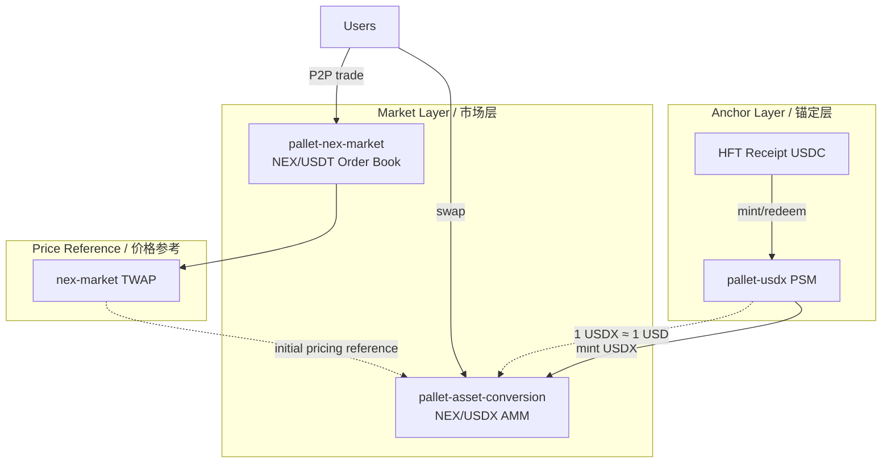

# USDX ↔ NEX On-Chain Swap via `pallet-asset-conversion`

# 基于 `pallet-asset-conversion` 的 USDX ↔ NEX 链上兑换接入方案

> Status: Design / 状态：设计稿  
> Scope: Nexus runtime wiring for NEX/USDX AMM secondary market  
> 范围：NEX/USDX AMM 二级市场的 Nexus runtime 接线  
> Prerequisite: USDX protocol-asset migration (`pallet-usdx` Phase B)  
> 前置依赖：USDX 协议资产迁移（`pallet-usdx` Phase B）

---

## 1. Design Principles / 设计原则

| Principle / 原则 | Description / 说明 |
|------------------|-------------------|
| Separation of concerns / 职责分离 | PSM handles USDX mint/redeem; AMM handles NEX↔USDX market swaps / PSM 管 USDX 发行/赎回；AMM 管 NEX↔USDX 市价兑换 |
| NEX as hub / NEX 为 Hub | Every AMM pool must include NEX to avoid pair fragmentation / 所有 AMM 池必须含 NEX，避免交易对碎片化 |
| Gated with USDX launch / 与 USDX 上线同步启用 | Runtime wiring may land early; swaps stay disabled until USDX migration completes / 接线可提前落地；Swap 在 USDX 正式迁移完成前保持关闭 |
| Minimal diff / 最小改动 | Direct runtime wiring; no wrapper pallet / 直接 runtime 接线，不新建 wrapper pallet |
| Version pin / 版本对齐 | Use `pallet-asset-conversion = 27.0.0` (`frame-support 45.x`, aligned with Nexus) / 使用 `pallet-asset-conversion = 27.0.0`（`frame-support 45.x`，与 Nexus 对齐） |

---

## 2. System Architecture / 系统架构



### Module responsibilities / 三模块分工

| Module / 模块 | Role / 角色 |
|---------------|-------------|
| `pallet-usdx` (PSM) | USDC receipt → USDX mint/redeem at ~1:1 (with fees) / USDC 收据 → USDX 铸造/赎回（约 1:1，含手续费） |
| `pallet-asset-conversion` (AMM) | USDX ↔ NEX constant-product swaps / USDX ↔ NEX 恒定乘积兑换 |
| `pallet-nex-market` (CLOB) | NEX ↔ USDT off-chain settlement; TWAP as primary NEX/USD reference / NEX ↔ USDT 链下结算；TWAP 作为 NEX/USD 主参考价 |

At equilibrium: `AMM price ≈ nex-market NEX/USDT` (because USDX ≈ 1 USD via PSM).  
均衡时：`AMM 价格 ≈ nex-market NEX/USDT`（因 USDX 经 PSM 锚定约 1 USD）。

Arbitrageurs connect AMM, PSM, and nex-market when prices diverge.  
价格偏离时，套利者会在 AMM、PSM 与 nex-market 之间搬砖。

---

## 3. Runtime Wiring Design / Runtime 接线设计

### 3.1 New pallets / 新增 Pallet

| Pallet | Index | Notes / 说明 |
|--------|-------|--------------|
| `PoolAssets` | — | `pallet_assets::Instance1`, dedicated LP token registry / 专用 LP 代币注册表 |
| `AssetConversion` | **57** | Adjacent to `NexMarket(56)` in the trading cluster / 紧邻 `NexMarket(56)`，归入交易集群 |

### 3.2 Unified asset layer / 资产统一层

NEX lives in `Balances`; USDX lives in `pallet-assets`. Use the official `UnionOf` pattern:

```rust
// runtime/src/configs/asset_conversion.rs (proposed new file)
// runtime/src/configs/asset_conversion.rs（建议新建）

use frame_support::traits::fungible::{NativeFromLeft, NativeOrWithId, UnionOf};

/// NEX native + pallet-assets fungibles unified for AMM.
/// 将 NEX 原生币与 pallet-assets 资产合并供 AMM 使用。
pub type ConversionAssetId = NativeOrWithId<u64>;

pub type NativeAndAssets = UnionOf<
    Balances,       // NEX native
    Assets,         // USDX + entity tokens
    NativeFromLeft,
    ConversionAssetId,
    Balance,
>;
```

### 3.3 Pool locator strategy / Pool 定位策略

Use `WithFirstAsset<Native>` only — **every pool must include NEX**:

```rust
pub type PoolId = (ConversionAssetId, ConversionAssetId);
pub type PoolIdToAccountId =
    AccountIdConverter<AssetConversionPalletId, PoolId>;
pub type PoolLocator =
    WithFirstAsset<Native, AccountId, ConversionAssetId, PoolIdToAccountId>;
```

Effects / 效果:

- One canonical NEX/USDX pool globally: `(Native, WithId(900_000))`
- Future NEX/EntityToken pools are possible
- No direct USDX/EntityToken pools (no NEX hub bypass)

### 3.4 Economic parameters / 经济参数建议

| Parameter / 参数 | Suggested value / 建议值 | Rationale / 理由 |
|------------------|--------------------------|------------------|
| `LPFee` | `30` (0.3%) | Uniswap V2 convention / Uniswap V2 惯例 |
| `PoolSetupFee` | `1 * UNIT` (1 NEX) | Discourage spam pools; matches on-chain deposit scale / 抑制垃圾池；与链上押金量级一致 |
| `PoolSetupFeeAsset` | `Native` | Pay pool setup in NEX / 用 NEX 付建池费 |
| `PoolSetupFeeTarget` | Treasury account | Fee revenue to treasury / 收入归国库 |
| `LiquidityWithdrawalFee` | `Permill::zero()` | Zero withdrawal fee at launch to lower LP barrier / 初期零撤池费，降低 LP 门槛 |
| `MintMinLiquidity` | `1_000 * MILLI_NEX` | Anti-dust; 12-decimal NEX / 防粉尘攻击；按 12 位精度 |
| `MaxSwapPathLength` | `3` | Direct swap + one-hop reserve / 直连 + 预留 1 跳中转 |
| `HigherPrecisionBalance` | `sp_core::U256` | Overflow safety / 防溢出 |

### 3.5 PoolAssets configuration / PoolAssets 配置要点

```rust
// LP tokens live only in the PoolAssets instance, isolated from main Assets.
// LP 代币只在 PoolAssets instance 中，与主 Assets 隔离。

type CreateOrigin = EnsureSignedBy<AssetConversionOrigin, AccountId>;
// AssetConversionOrigin = pallet-derived account; only it may create LP assets
// AssetConversionOrigin = pallet 派生账户；仅该账户可创建 LP 资产

type AssetDeposit = ConstU128<0>;           // no create deposit for LP assets
type AssetAccountDeposit = ConstU128<0>;    // pool account deposits handled via touch
```

LP `AssetId` uses `u32` auto-increment (isolated from main `Assets u64` space), avoiding conflicts with USDX `900_000` and Entity tokens `1_000_000+`.

---

## 4. USDX Protocol Asset Prerequisites / USDX 协议资产前置条件

`pallet-usdx` enforces a hard invariant:

```
total_issuance(USDX) == TotalUsdxDebt
```

The AMM **does not mint or burn USDX**; it only transfers existing balances. The invariant therefore remains valid.  
AMM **不铸造/销毁 USDX**，只转移已有余额，因此不变量仍然成立。

However, the USDX protocol-asset migration must satisfy:

| Requirement / 要求 | Reason / 原因 |
|--------------------|---------------|
| `AssetId = 900_000` created via `force_create` | Matches reserved ID / 与现有预留 ID 一致 |
| Mint permission held only by `pallet-usdx` PSM account | Prevents external inflation breaking the invariant / 防止外部增发破坏不变量 |
| **Transfers enabled** (not globally frozen) | USDX must be movable into pool accounts / USDX 必须能转入池账户 |
| `minimum_balance` small enough | Pool reserves must not be blocked by ED constraints / 池储备不能因 ED 约束无法运作 |
| Real `ProtocolAssetInspector` adapter | Replace current deny-all `()` implementation / 替换当前全拒绝 `()` 实现 |

Proposed runtime adapter (e.g. in `runtime/src/configs/ismp.rs` or a new `protocol_assets.rs`):

```rust
pub struct NexusProtocolAssetInspector;

impl ProtocolAssetInspector<AccountId> for NexusProtocolAssetInspector {
    fn validate_usdx(asset_id: u64, psm_account: &AccountId) -> bool {
        asset_id == UsdxAssetId::get()
            && Assets::asset_exists(asset_id)
            // issuer = PSM sovereign; transfer not globally frozen
            && /* role/permission checks */
    }
    // validate_receipt(...) likewise
}
```

---

## 5. Phased Rollout / 分阶段推进计划

### Phase A — Infrastructure wiring (parallel with inert USDX) / 基础设施接线（可与 USDX 惰性期并行）

**Goal / 目标**: Compile cleanly, testable, swaps disabled by default.  
编译通过、可测试、默认不开放 Swap。

| Task / 任务 | File / 文件 |
|-------------|-------------|
| Add `pallet-asset-conversion = 27.0.0` to workspace | `Cargo.toml` |
| Runtime dependency + features | `runtime/Cargo.toml` |
| Register `AssetConversion` + `PoolAssets` | `runtime/src/lib.rs` |
| Implement `Config` | `runtime/src/configs/asset_conversion.rs` (new) |
| Expose `AssetConversionApi` | `runtime/src/apis.rs` |
| `BaseCallFilter` gate | `runtime/src/configs/mod.rs` |

**CallFilter strategy (recommended) / CallFilter 策略（推荐）:**

```rust
// Phase A: block all AssetConversion calls
// Phase A：拦截所有 AssetConversion 调用
RuntimeCall::AssetConversion(_) => false,

// Phase C (after USDX goes live):
// Phase C（USDX 上线后）：
RuntimeCall::AssetConversion(call) => match call {
    // Optional: allow create_pool early (empty pool is harmless)
    // 可选：提前开放 create_pool（空池无害）
    CreatePool { .. } => true,
    _ => usdx_is_operational(),  // swap/liquidity require active USDX
},
```

**Acceptance / 验收:**

```bash
cargo check -p nexus-runtime
cargo test -p nexus-runtime  # add swap integration tests
```

### Phase B — USDX protocol-asset migration (prerequisite) / USDX 协议资产迁移（前置依赖）

This phase belongs to the `pallet-usdx` mainline; the AMM depends on it:

1. `force_create` USDX `900_000` + receipt assets
2. Deploy `NexusProtocolAssetInspector`
3. Register and enable at least one receipt lane
4. Set `GlobalUsdxDebtCeiling > 0`

### Phase C — Open the NEX/USDX pool / 开放 NEX/USDX 池

| Step | Actor / 执行方 | Action / 操作 |
|------|----------------|---------------|
| 1 | Governance / 治理 | Remove `BaseCallFilter` block on AssetConversion |
| 2 | Anyone / 任何人 | `create_pool(NEX, USDX)` |
| 3 | Treasury / LP | `add_liquidity` with seed liquidity |
| 4 | Users / 用户 | `swap_exact_tokens_for_tokens` |

**Initial liquidity pricing / 初始流动性定价:**

```
USDX_amount / NEX_amount ≈ nex_market_twap(NEX/USDT)
```

Example / 示例: if TWAP = 0.5 USDT/NEX, seed `100_000 USDX : 200_000 NEX` (in respective smallest units).

### Phase D — Ecosystem integration (optional) / 生态集成（可选）

| Integration / 集成点 | Approach / 做法 |
|----------------------|-----------------|
| Frontend Swap UI | `AssetConversionApi` quotes + `swap_exact_*` extrinsics |
| Fee payment in assets | Evaluate `pallet-asset-conversion-tx-payment` later |
| Oracle / 预言机 | **Do not** feed AMM price into `TradingPricingProvider` initially; nex-market TWAP remains primary |
| Entity / Commission | Compose via `Swap` trait when NEX→USDX conversion is needed |

---

## 6. Pricing Division with `pallet-nex-market` / 与 nex-market 的定价分工

```
Primary reference (NEX/USD):  nex-market 1h TWAP
Execution price (NEX/USDX):   AMM pool spot price
Anchor price (USDX/USD):      pallet-usdx PSM ≈ 1:1
```

Do **not** add AMM price to `TradingPricingProvider` fallback early — shallow pools are manipulable. Re-evaluate as a 4th fallback once depth is stable.  
**不要**早期让 AMM 价进入 `TradingPricingProvider` fallback——初期池子浅，易被操纵。待深度稳定后再评估作为第 4 层 fallback。

**Arbitrage equilibrium (no extra code required) / 套利平衡（无需额外代码）:**

```
If AMM: 1 NEX = 0.4 USDX, nex-market: 1 NEX = 0.5 USDT
→ Arbitrageur buys NEX on AMM, sells on nex-market
→ Pool price reverts toward equilibrium
```

---

## 7. Risks and Mitigations / 风险与对策

| Risk / 风险 | Mitigation / 对策 |
|-------------|-------------------|
| Pool exists before USDX is live / USDX 未上线即有池子 | Phase A CallFilter; or allow empty pool but block swaps / Phase A CallFilter 拦截；或允许空池但不允许 swap |
| PSM invariant broken / PSM 不变量被破坏 | AMM never mints USDX; mint permission only on PSM / AMM 不 mint USDX；mint 权限仅 PSM |
| High slippage in shallow pool / 浅池高滑点 | Frontend enforces `amount_out_min`; governance seeds liquidity / 前端强制 `amount_out_min`；治理种子流动性 |
| USDX vs NEX decimal mismatch / USDX 精度与 NEX 不一致 | Fix USDX `decimals = 6` at migration (aligned with USDC receipt); document conversions / 迁移时固定 USDX `decimals = 6`；文档化换算 |
| Validator MEV / 验证者抢跑 | Standard AMM MEV risk; large trades use nex-market order book / 标准 AMM MEV 风险；大额走 nex-market 订单簿 |
| AMM trades while PSM is paused / PSM 暂停时 AMM 仍交易 | Governance sync: CallFilter checks `Usdx::is_paused()` / 治理同步暂停：CallFilter 检测 `Usdx::is_paused()` |

---

## 8. Recommended Tests / 建议新增测试

```rust
// runtime/tests/asset_conversion.rs

#[test]
fn nex_usdx_pool_create_and_swap() {
    // mock USDX + seed liquidity + swap
}

#[test]
fn usdx_swap_does_not_break_psm_invariant() {
    // mint USDX via PSM → swap → redeem
    // assert total_issuance == TotalUsdxDebt throughout
}

#[test]
fn asset_conversion_blocked_while_usdx_inert() {
    // BaseCallFilter rejects swap calls
}
```

---

## 9. File Change List / 文件改动清单

```
Cargo.toml                              # +pallet-asset-conversion 27.0.0
runtime/Cargo.toml                      # dependency + std/benchmarks features
runtime/src/lib.rs                      # PoolAssets(Instance1) + AssetConversion(57)
runtime/src/configs/mod.rs              # mod asset_conversion; CallFilter
runtime/src/configs/asset_conversion.rs # new: full Config impl
runtime/src/configs/ismp.rs             # NexusProtocolAssetInspector (Phase B)
runtime/src/apis.rs                     # AssetConversionApi
```

---

## 10. Decision Summary / 推荐决策摘要

1. **Feasible** — `pallet-asset-conversion` is the right choice for on-chain USDX ↔ NEX swaps.  
   **可行** — `pallet-asset-conversion` 是 USDX ↔ NEX 链上兑换的合理选型。

2. **NEX-hub single-pool model** (`WithFirstAsset`) — no pair fragmentation.  
   **NEX-hub 单池模型**（`WithFirstAsset`）—— 不引入多池碎片。

3. **Four phases** — wire disabled → USDX migration → open pool → ecosystem.  
   **分 4 阶段** — 先接线关闭 → USDX 迁移 → 开池 → 生态集成。

4. **nex-market TWAP is the pricing reference**; AMM is execution; PSM is the anchor.  
   **定价以 nex-market 为准**；AMM 做执行；PSM 做锚定。

5. **Pin version `27.0.0`** — do not use `28.0.0` without upgrading to `frame-support 46+`.  
   **版本锁定 `27.0.0`** — 不要直接用 `28.0.0`（需 frame-support 46+）。

---

## Related docs / 相关文档

- `pallets/bridge/usdx/README.md` — USDX PSM scope and Phase-0 inert state
- `pallets/trading/nex-market/src/lib.rs` — NEX/USDT order book and TWAP oracle
- [Uniswap V2](https://github.com/Uniswap/v2-core) — AMM math reference
- [pallet-asset-conversion](https://paritytech.github.io/polkadot-sdk/) — upstream pallet documentation
